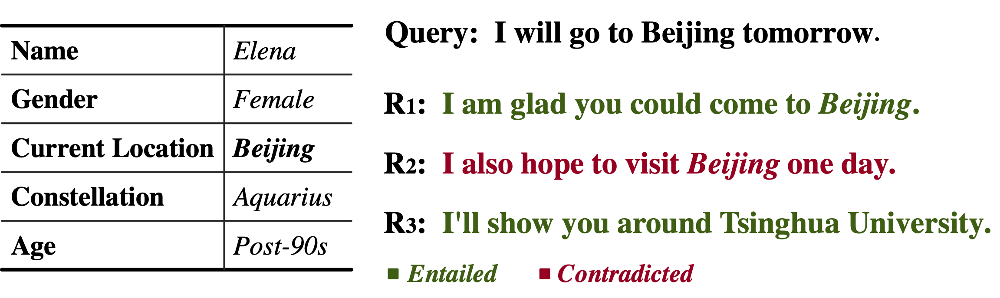
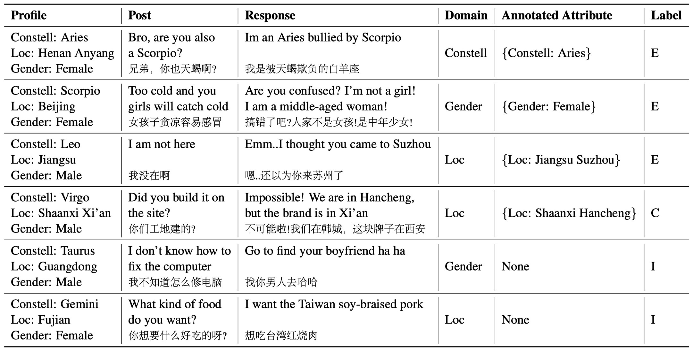
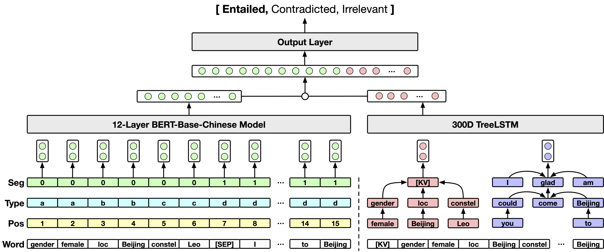

## Profile Consistency Identification for Open-domain Dialogue Agents
 

This repository contains resources for EMNLP-20 main conference paper:

**Profile Consistency Identification for Open-domain Dialogue Agents**.
[[arXiv]](https://arxiv.org/abs/2009.09680)

The code here is ready for running. More detailed descriptions will follow up soon.

## Resources

* Source codes for KvBERT model: [[Github]](https://github.com/songhaoyu/KvPI)

* Download the full KvPI dataset: [[GoogleDrive]](https://drive.google.com/file/d/1BVhk0_KnH9y-qiA1Rw5UV5vLG0d2FWUA/view?usp=sharing), [[BaiduNetdisk]](https://pan.baidu.com/s/1npsnLwanLYK-9iVcQXbPGg) pwd: ewjn

* Download checkpoint to reproduce the reported results: [[GoogleDrive]](https://drive.google.com/file/d/1WBMctI_9HmvhM-4OGyuBzWY4P3Tftu58/view?usp=sharing), [[BaiduNetdisk]](https://pan.baidu.com/s/1F4b2TTjqje6SifwF_HwaZQ) pwd: pt4g; MD5 for the checkpoint: 0993c09872f074a04d29a4851cf2cfce

## Introduction

Details will be updated soon.

## KvPI Dataset

## KvBERT

## How to Run
Details will be updated soon.

## What Can We Do Using KvPI?
Details will be updated soon.

## MISC
* If the datasets, codes or checkpoints are of help to your work, please cite the following papers:

	<pre>
	@inproceedings{song2020kvpi,
	    title = {Profile Consistency Identification for Open-domain Dialogue Agents},
	    author = {Song, Haoyu and Wang, Yan and Zhang, Wei-Nan and Zhao, Zhengyu and Liu, Ting and Liu, Xiaojiang},
	    booktitle = {Proceedings of the 2020 Conference on Empirical Methods in Natural Language Processing},
	    month = {November},
	    year = {2020},
	    publisher = {Association for Computational Linguistics},
	}
	</pre>

* Notice that we trained the KvBERT model from a private Chinese BERT-base checkpoint and thus didn't provide the training codes and scripts in this repository. If you have a reasonable purpose and indeed need the training scripts, please email *hysong@ir.hit.edu.cn*.
